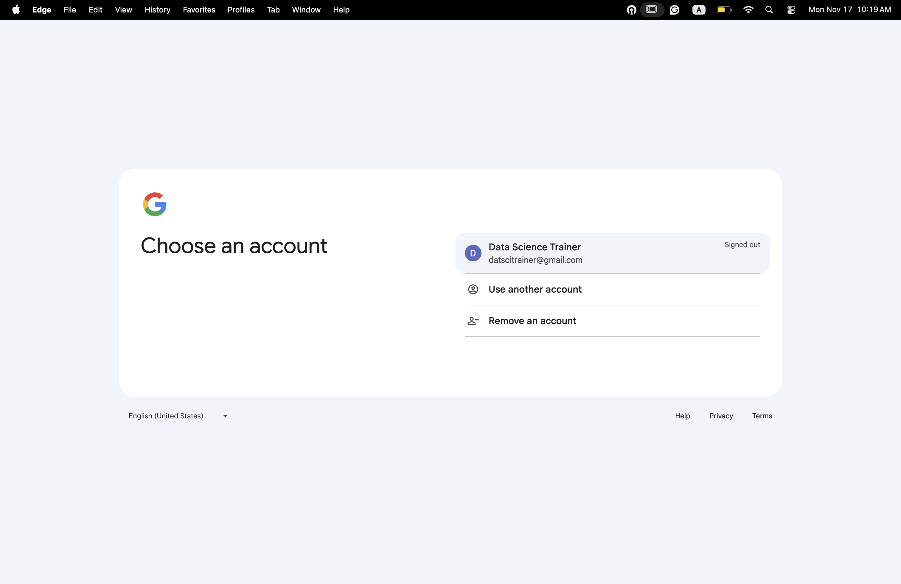
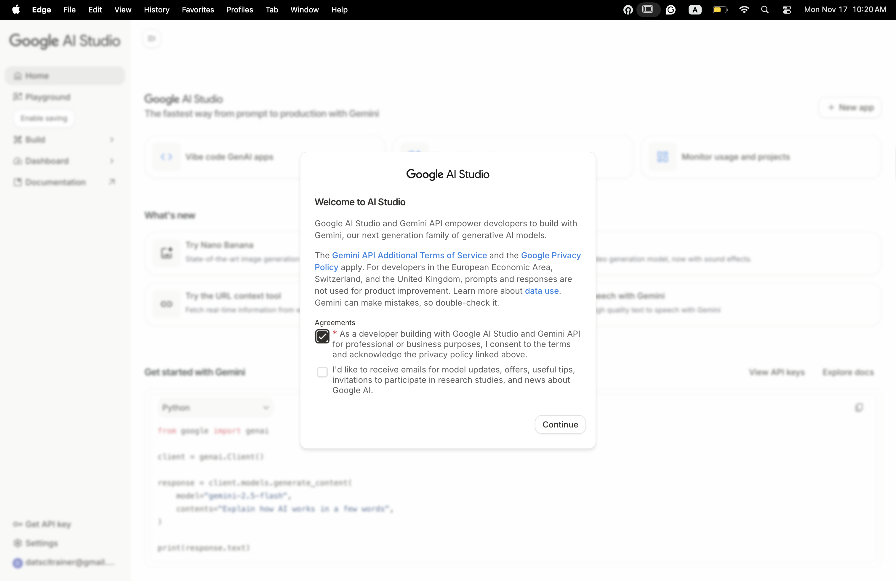
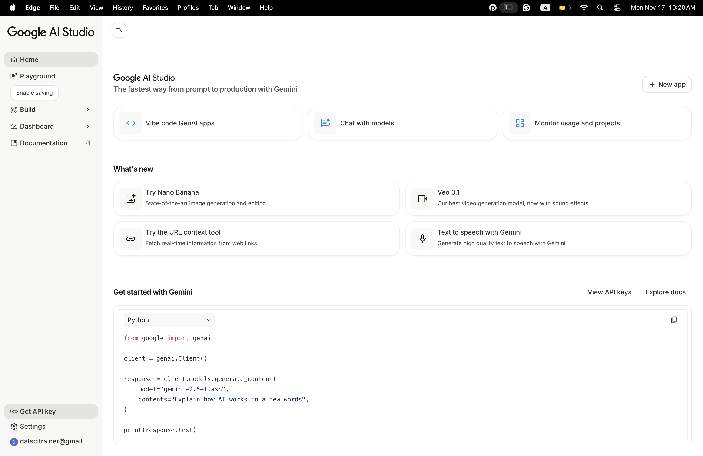
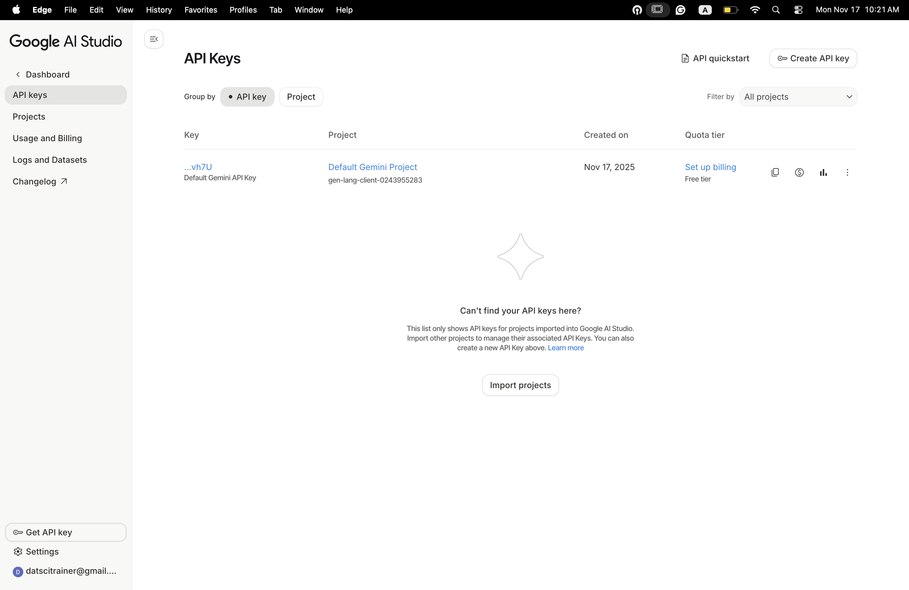
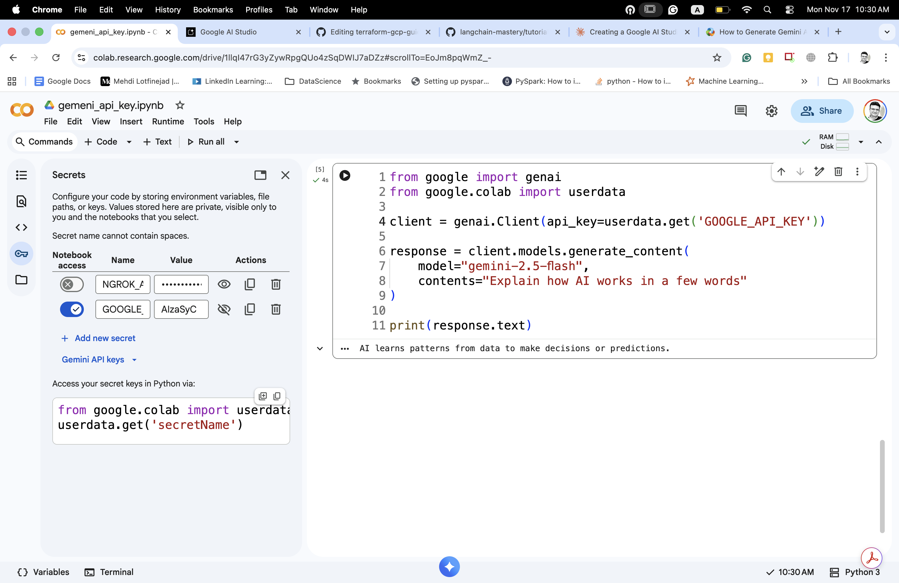

# Quick Guide: Creating a Google AI Studio API Key

Getting started with Google's Gemini API is straightforward. Here's how to create your API key in a few simple steps:

## Step 1: Access Google AI Studio
Visit [aistudio.google.com](https://aistudio.google.com). You'll see the AI Studio homepage.


Click the "Get Started" button in the top right corner. You'll be prompted to sign in with your Google account.



## Step 2: Accept Terms
After signing in, you'll see a welcome dialog. Check the box to consent to the Gemini API Additional Terms of Service and Google Privacy Policy, then click "Continue."



## Step 3: Navigate to API Keys
Once you've accepted the terms, look for the "Get API key" button in the left sidebar, or go directly to the API keys section from the dashboard.



## Step 4: Create Your Key
Click "Create API key" in the top right corner. Your new API key will be generated instantly and linked to your default Gemini project.



## Step 5: Copy and Secure Your Key
Your API key will appear in the format `AIza...`. Copy it immediately and store it securely. Never share your API key publicly or commit it to version control.



*Note: The image above shows the Colab Secrets setup, which is covered in detail below.*

## Using Your API Key in Google Colab

Google Colab provides a secure way to store your API key using **Secrets**:

### Setting up Secrets in Colab:
1. Click the **key icon** (🔑) in the left sidebar to open the Secrets panel
2. Click **"Add new secret"**
3. Enter a name like `GOOGLE_API_KEY`
4. Paste your API key as the value
5. Toggle on notebook access for your secret

### Using the Secret in Your Code:

```python
from google import genai
from google.colab import userdata

# Securely retrieve your API key from Colab secrets
client = genai.Client(api_key=userdata.get('GOOGLE_API_KEY'))

response = client.models.generate_content(
    model="gemini-2.5-flash",
    contents="Explain how AI works in a few words"
)

print(response.text)
```

**Why Use Secrets?**
- Keeps your API key private and secure
- Prevents accidental exposure when sharing notebooks
- Easy to access across multiple notebooks
- No hardcoded credentials in your code

**Important Notes:**
- The free tier includes generous usage limits
- Monitor your usage in the "Usage and Billing" section
- Keep your API key confidential
- You can create multiple keys for different projects

That's it! You're now ready to start building with Gemini securely in Google Colab.